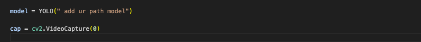

---

# Hand Pose Estimation with YOLO

This project uses YOLO (You Only Look Once) to perform hand pose estimation. YOLO is a popular object detection algorithm that can be adapted for various tasks, including hand pose estimation. This README provides instructions for setting up the environment and running the hand pose estimation using Conda.

## Prerequisites

- Conda (Anaconda or Miniconda)
- Python 3.7 or later
- YOLOv5 or YOLOv4 model for hand pose detection

## Setup

### 1. Clone the Repository

First, clone the repository containing the YOLO-based hand pose estimation code.

```bash
git clone git@github.com:sharathnarayan12/yolo-hand-pose.git
cd yolo-hand-pose
```

### 2. Create a Conda Environment

Create a new Conda environment with the necessary dependencies.

```bash
conda create -n hand_pose_estimation python=3.8
conda activate hand_pose_estimation
```

### 3. Install Dependencies

Install the required packages. The project uses `requirements.txt` to manage Python dependencies.

```bash
pip install -r requirements.txt
```
### 4. add the YOLO Model to path
 -  add model path to main python file 

 
### 5. Run Hand Pose Estimation

Execute the script to start hand pose estimation.

```bash
cd  detection
python main.py
```
## License

This project is licensed under the MIT License. See the [LICENSE](LICENSE) file for more details.

---

Feel free to customize this README based on your project's specifics or additional requirements.